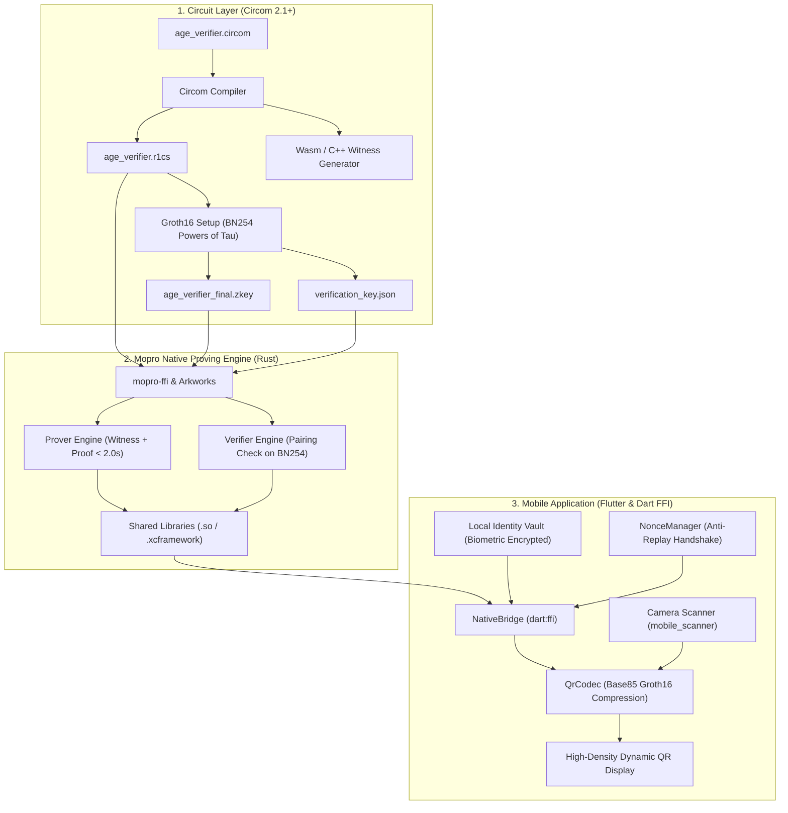

# zk-MatchID Architecture & Cryptographic Design

zk-MatchID is a peer-to-peer (P2P), offline-first mobile mutual authentication application designed for privacy-preserving verification (such as age verification or credential ownership) without disclosing personally identifiable information (PII).

---

## 1. System Architecture Diagram

---

## 2. Cryptographic Protocol Specifications

### 2.1 Elliptic Curve & Proving System
- **Proving System:** Groth16 Zero-Knowledge Proof System.
- **Curve:** BN254 (alt_bn128), offering ~128 bits of security with efficient bilinear pairings:
  $$e(A, B) = e(\alpha, \beta) \cdot e(x \cdot \gamma, \delta) \cdot e(C, \delta)$$
- **Proof Structure:**
  - $A \in G_1$ (2 field elements)
  - $B \in G_2$ (4 field elements)
  - $C \in G_1$ (2 field elements)

### 2.2 Circuit Signals & Constraints (`age_verifier.circom`)
- **Private Inputs:**
  - `birthYear`: User's integer birth year (kept secret in biometric vault).
  - `userSecretKey`: Secret field element seed.
- **Public Inputs:**
  - `currentYear`: Current calendar year.
  - `ageLimit`: Target verification threshold (e.g., 18).
  - `sessionNonce`: Interactive ephemeral challenge generated by the Verifier.
- **Public Output:**
  - `nullifier`: Computed as $\text{Poseidon}(\text{userSecretKey}, \text{sessionNonce})$.
- **Constraints:**
  1. $\text{currentYear} \ge \text{birthYear}$
  2. $\text{age} = \text{currentYear} - \text{birthYear}$
  3. $\text{age} \ge \text{ageLimit}$ enforced via 16-bit comparator (`GreaterEqThan(16)`).

### 2.3 QR Payload Optimization & Compression
Groth16 proofs serialized in naive JSON format typically exceed 800–1000 bytes, which results in overly dense, slow-scanning QR codes. zk-MatchID implements an Ascii85 (Base85) encoder:
1. Proof coordinates ($A, B, C$) and public inputs are serialized into compact binary/UTF-8 format.
2. The payload is encoded using Ascii85 (`qr_codec.dart`), compressing 4 bytes into 5 printable ASCII characters.
3. This achieves high scan reliability on standard smartphone cameras under low-light and offline conditions.
