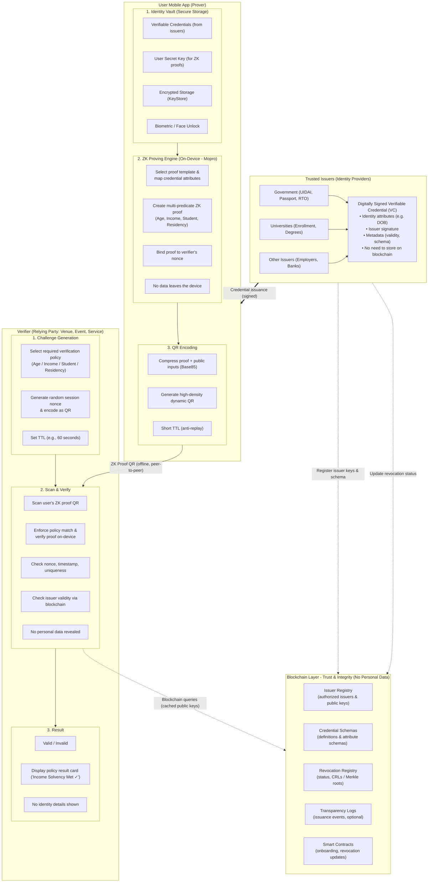

# zk-MatchID: End-to-End Architecture & Cryptographic Design
*Privacy-Preserving Identity Verification with Zero-Knowledge Proofs*  
**"Prove what's needed. Keep the rest private."**

---

## 1. High-Level Architecture Diagram

---

## 2. End-to-End Lifecycle Flow (6 Steps)

1. **Issuer Onboards:** Issuer registers public key and credential schema on the Blockchain Layer (`IssuerRegistry.sol`, `CredentialSchemaRegistry.sol`).
2. **Issue Credential:** Issuer signs credential using its private key and provides it to user via secure channel (`issuer_service.js`).
3. **Store in Vault:** User stores credential in encrypted mobile vault protected by biometric authentication (`VaultService`).
4. **Verifier Challenge:** Verifier selects the required verification policy (e.g. `Age >= 18`, `Income Solvency`, `Student Status`, `Regional Residency`), generates a random session nonce with TTL, and renders a dynamic challenge QR code (`VerifierScreen`).
5. **Generate Proof:** Prover selects a matching proof template; the app maps the vault credential's attributes onto `generic_verifier.circom`, generates the Groth16 zero-knowledge proof on-device bound to the verifier nonce, and encodes it in a Base85 dynamic QR (`ProverScreen`).
6. **Verify:** Verifier scans proof QR offline, enforces the selected policy match (`predicate_type`), checks Groth16 pairing constraints, validates anti-replay nonce, checks issuer validity via blockchain cache, and displays the policy result card (`"VERIFIED: Income Solvency Met ✓"`).

---

## 3. Cryptographic Specifications

### 3.1 Proving System & Curve
- **Algorithm:** Groth16 Zero-Knowledge Proof.
- **Curve:** BN254 (alt_bn128) pairing over prime order $r$:
  $$e(A, B) = e(\alpha, \beta) \cdot e(x \cdot \gamma, \delta) \cdot e(C, \delta)$$
- **Proof Structure:** 8 field elements ($A \in G_1, B \in G_2, C \in G_1$).

### 3.2 Circuit Signals & Constraints (`generic_verifier.circom`)

The generic multi-predicate circuit evaluates every supported predicate mode against a single private attribute commitment, so one proving engine serves all verification profiles:

| Mode | Predicate | Constraint | Example |
| :--- | :--- | :--- | :--- |
| **Mode 1 — Threshold / Range** | $\text{attributeValue} \ge \text{thresholdA}$ | `GreaterEqThan(32)` | $Income \ge \$4{,}000$, $CreditScore \ge 700$ |
| **Mode 2 — Set Membership** | $\text{attributeValue} \in \text{allowedSet}[0..4]$ | $\prod_{i=0}^{4}(\text{attributeValue}-\text{allowedSet}_i)=0$ | Accredited institution / eligible jurisdiction whitelist |
| **Mode 3 — Derived Threshold (Age)** | $\text{thresholdB} - \text{attributeValue} \ge \text{thresholdA}$ | `GreaterEqThan(32)` on derived value | $\text{currentYear}-\text{birthYear}\ge 18$ |

Two constraints are enforced in **every** mode:

- **Validity & Expiry:** $\text{credentialExpiry} \ge \text{currentTimestamp}$ via `GreaterEqThan(32)` — expired credentials can never produce a valid proof.
- **Anti-Replay Nullifier:** public output $\text{nullifier} = \text{Poseidon}(\text{userSecretKey}, \text{sessionNonce})$ binds the proof to one ephemeral verifier challenge.

Signal layout:

- **Private Inputs:** `attributeValue` (birthYear, monthlyIncome, institutionId or jurisdictionCode), `userSecretKey`, `credentialExpiry`.
- **Public Inputs:** `predicateMode`, `thresholdA`, `thresholdB`, `allowedSet[5]`, `currentTimestamp`, `sessionNonce`.
- **Public Output:** `nullifier`.

Mode selection is enforced with multiplexer constraints (`(predicateMode - m_i) · …` factors), so a prover cannot claim mode 1 while skipping the mode 1 comparator. The legacy single-purpose `age_verifier.circom` remains in the repository as the reference baseline for benchmarking.

### 3.3 High-Density Base85 QR Codec
Groth16 proofs and public inputs are packed and compressed via Ascii85 (Base85) encoding (`qr_codec.dart`). This achieves up to ~30-40% size reduction over raw JSON, ensuring high optical readability across low-cost mobile phone cameras without internet.

---

## 4. Security & Privacy Guarantees

| Property | Description |
| :--- | :--- |
| **Zero Knowledge** | Verifier learns strictly the boolean outcome of the selected policy (e.g. $age \ge 18$, $income \ge 4000$, membership in an allowed set); dates of birth, balances, student IDs and addresses are never revealed. |
| **Anti-Replay** | Ephemeral nonce challenge and single-use validation prevent video camera replay. |
| **Offline First** | Prover and Verifier require zero network or cloud connectivity during handshake. |
| **Trust Integrity** | Blockchain smart contracts maintain tamper-proof issuer public keys and revocations. |
| **Hardware Encryption**| Identity Vault is secured by hardware KeyStore and Biometrics (Face/Fingerprint). |
