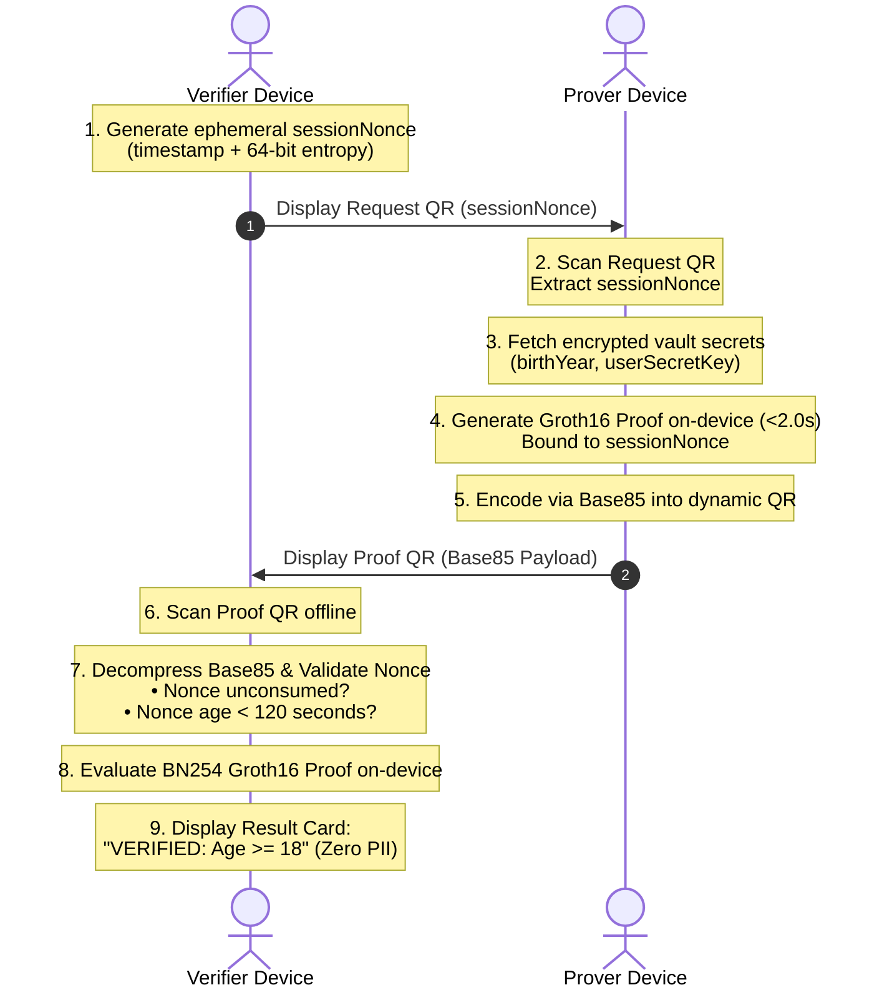

# Interactive Anti-Replay QR Handshake Protocol

To prevent replay attacks—such as an attacker displaying a recorded video or screenshot of an authentic QR proof—zk-MatchID implements an interactive, offline 2-step challenge-response handshake protocol.

---

## 1. Sequence Diagram



---

## 2. Handshake Phase Details

### Step 1: Challenge Nonce Generation
- The Verifier device creates a dynamic nonce:
  $$\text{nonce} = \text{timestamp} \mathbin{\Vert} \text{random\_bytes}(8)$$
- This nonce is formatted and rendered as a lightweight, instantly readable QR code on `VerifierScreen`.

### Step 2: Prover Challenge Ingestion
- The Prover scans the Verifier's challenge QR using the in-app camera or manually enters the challenge.
- The `sessionNonce` is bound into the Circom input parameter list:
  ```json
  {
    "birthYear": 2000,
    "userSecretKey": "...",
    "currentYear": 2024,
    "ageLimit": 18,
    "sessionNonce": "1726955000000_3a8f9c1b2d4e6f80"
  }
  ```

### Step 3: Zero-Knowledge Proof Execution
- Native Mopro Rust engine executes witness calculation and Groth16 proving on the BN254 curve.
- Execution completes within $< 2.0$ seconds on mobile hardware.
- The proof output binds the calculated `nullifier` ($\text{Poseidon}(\text{secret}, \text{nonce})$) and the `sessionNonce`.

### Step 4: Verification & Anti-Replay Enforcement
- The Verifier scans the Prover's high-density Base85 QR.
- The Verifier's `NonceManager` verifies:
  1. The nonce has not been previously consumed in the verifier's session cache.
  2. The nonce timestamp is within the 120-second validity window.
  3. If valid, the nonce is immediately committed to the consumed list. Any subsequent scan of the same QR code immediately triggers:
     `REPLAY ATTACK PREVENTED: Nonce already consumed`
- The Groth16 pairing equation is verified offline:
  $$e(A, B) \stackrel{?}{=} e(\alpha, \beta) \cdot e(x \cdot \gamma, \delta) \cdot e(C, \delta)$$
- The user is notified on `VerifierScreen` with zero PII disclosed.
