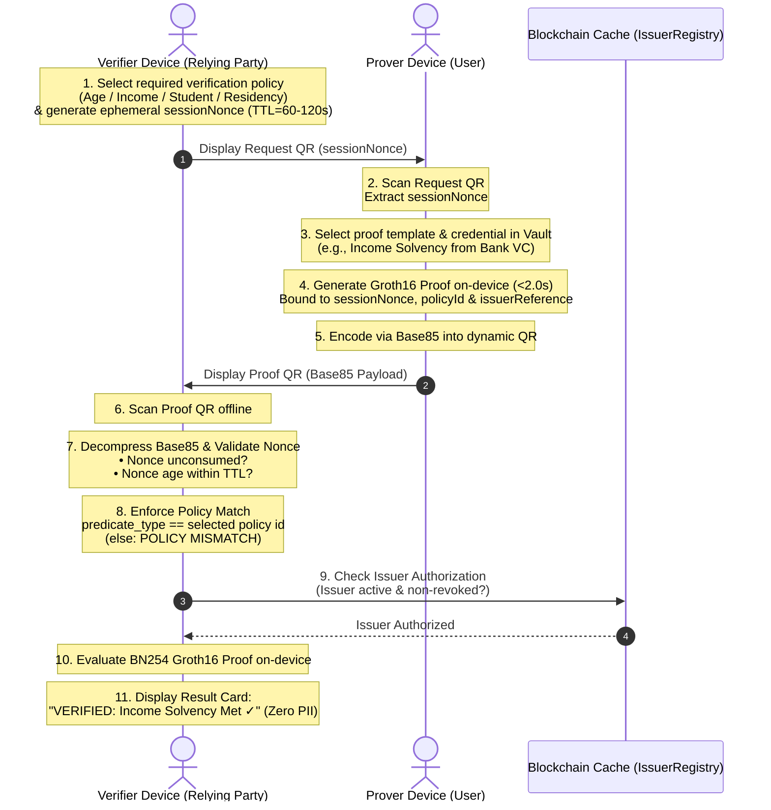

# Interactive Anti-Replay QR Handshake Protocol

To prevent replay attacks—such as an attacker displaying a recorded video or screenshot of an authentic QR proof—zk-MatchID implements an interactive, offline 2-step challenge-response handshake protocol with blockchain issuer validation.

---

## 1. Sequence Diagram



---

## 2. Handshake Phase Details

### Step 1: Policy Selection & Challenge Nonce Generation
- Before rendering the challenge, the Verifier selects the **required verification policy** for this interaction:
  `Age >= 18`, `Income Solvency`, `Student Status`, or `Regional Residency`.
  The selected policy id travels with the request so the prover knows exactly which predicate to attest.
- The Verifier device then creates an ephemeral challenge:
  $$\text{nonce} = \text{timestamp} \mathbin{\Vert} \text{random\_bytes}(8)$$
- Renders as a lightweight, instantly readable QR code on `VerifierScreen` with a short TTL (e.g. 60–120s).

### Step 2: Prover Challenge Ingestion & Template Selection
- Prover scans the Verifier's QR code using the in-app camera or manually pastes the challenge.
- The Prover selects the matching **proof template** in `ProverScreen` (bound to a vault credential and a `generic_verifier.circom` predicate mode).
- The `sessionNonce`, `policyId` (`predicateType`) and `issuerReference` are bound into the proving parameters.

### Step 3: Zero-Knowledge Proof Execution
- Native Mopro Rust engine executes witness calculation and Groth16 proving on the BN254 curve in $< 2.0$ seconds against the selected predicate:
  - **Mode 1 — Threshold / Range:** $\text{attributeValue} \ge \text{thresholdA}$ (e.g. $income \ge 4000$).
  - **Mode 2 — Set Membership:** $\text{attributeValue} \in \text{allowedSet}[0..4]$ (institution / jurisdiction whitelist).
  - **Mode 3 — Derived Threshold (Age):** $\text{thresholdB} - \text{attributeValue} \ge \text{thresholdA}$.
  - Validity ($\text{credentialExpiry} \ge \text{currentTimestamp}$) is enforced in every mode.
- The proof output binds the calculated `nullifier` ($\text{Poseidon}(\text{secret}, \text{nonce})$) and the `sessionNonce`.
- The payload (`predicate_type`, `predicate_claim`, TTL, Groth16 points and public inputs) is compressed into high-density Ascii85 (Base85) for optical transmission:
  ```json
  [predicateMode, thresholdA, thresholdB, allowedSet[0..4], currentTimestamp, sessionNonce, nullifier]
  ```

### Step 4: Policy Enforcement, Verification, Issuer Check & Anti-Replay
- The Verifier scans the Prover's Base85 QR.
- The Verifier's `NonceManager` verifies:
  1. The nonce has not been previously consumed in the verifier's session cache.
  2. The nonce timestamp is within the TTL validity window.
  3. If valid, the nonce is immediately committed to the consumed list. Any subsequent scan of the same QR code immediately triggers:  
     `REPLAY ATTACK PREVENTED: Nonce already consumed`
- The Verifier enforces the **selected policy**: `payload.predicateType` must equal the selected policy id. A payload attesting a different predicate is rejected with `POLICY MISMATCH` — a proof can never silently substitute one claim for another.
- The Verifier checks the `issuerReference` against the cached `IssuerRegistry.sol`:
  - Confirms the issuer is registered, active, and not revoked.
- The Groth16 pairing equation is verified offline:
  $$e(A, B) \stackrel{?}{=} e(\alpha, \beta) \cdot e(x \cdot \gamma, \delta) \cdot e(C, \delta)$$
- The user is notified on `VerifierScreen` with the policy-specific result card (e.g. `"VERIFIED: Income Solvency Met ✓"`), the verified issuer badge, and zero PII disclosed.
